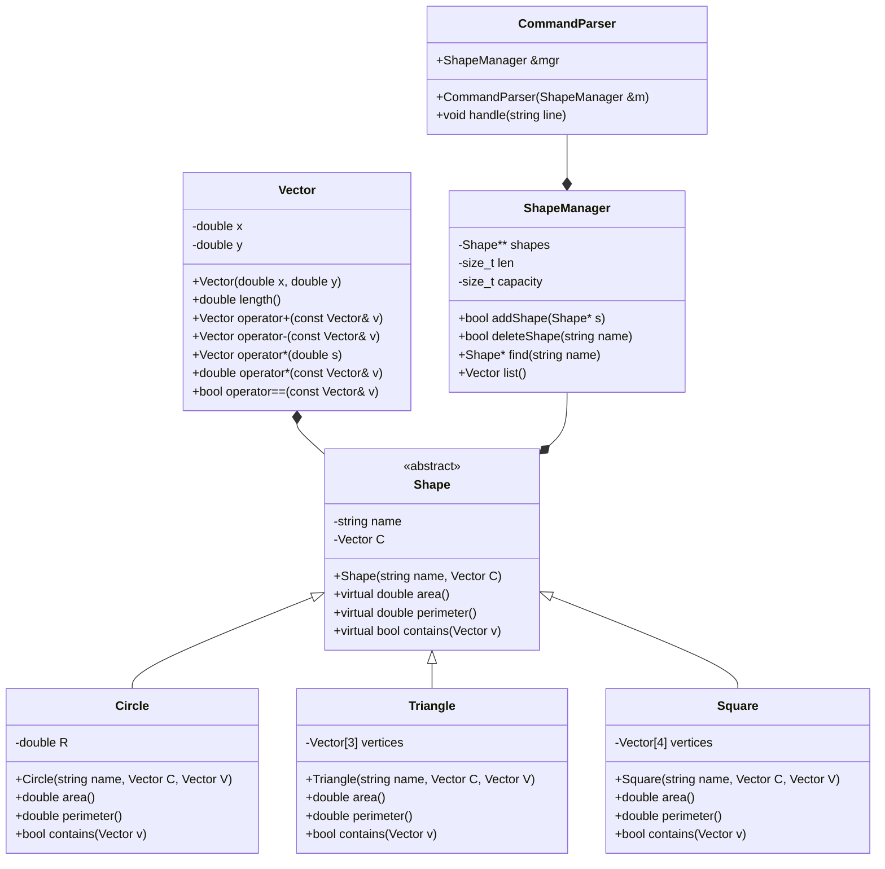

# Terv - Síkidomok
Vadoba Hunor

## 1. Feladatkörök:
- Parancsok feldolgozása (`CommandParser`).
- Alakzatok reprezentálása (`Shape` hierarchia).
- Alakzatok tárolása és kezelése (`ShapeManager`).
- Geometriai műveletek: `area()`, `perimeter()`, `contains(vector)` `Vector`.

## 2. UML osztálydiagram

## 3. Osztályok részletei
- `Vector` : `(x,y)` egyszerű adattároló, vektorműveletekkel.
- `Shape` : absztrakt osztály, virtuális függvényekkel.
- Egyszerű terület/kerület képlet a síkidomokhoz. ($\pi r^2, 2r\pi,$ $a^{2}\sqrt{3}\over4$ $,\dots$)
- Konstruktorok,($C, V$: középpont és egy csúcs/kerületi pont.)
- `Circle`: egyszerű, `R = dist(C,V)`.
- `Triangle`: a három csúcsot a C körül $60^\circ$ szögeloszlással számoljuk ki
- `Square`: $V$ a négyzet egyik csúcsa; a négy csúcs kiszámolható $C$ és $V$ alapján (forgás + tükrözés).

## 4. Pont helyzet eldöntése (.contains(v))
Poliginok oldalai ngybetűvel, sorban jelölve ($A,B, C, \dots$), kérdéses pont ($v$), középpont ($C$).

`Circle`: 
- $dist(C,v) \le R$

`Triangle`: 
- Előjeles keresztszorzással megállapítható hogy a pont az egyik oldalvektor jobb, vagy bal oldalán található.
- Ha mindegyik oldaltól csak jobbra, vagy csak balra található, a síkidomon belül helyezkedik el (az oldalvektorok egy körben egymásra mutatnak).
- Egy előjel eldöntése: $\overrightarrow{AB} \times (A-v) < 0$
  
`Square`: 
- Két szomszédos oldal derékszöget zár be egymással. Ezek lineáris kombinációjaként felírható $v$, mivel az oldalak bázist alkotnak $\mathbb{R}^2$-ben.
- $v = x \cdot \overrightarrow{BA} + y \cdot \overrightarrow{BC}$
- Ha $0 < x < 1$ és $0 < y < 1$, $v$ a négyzeten belül van.

## 5. Parancsfeldolgozás - rövid felvázolás
- `CommandParser::handle(line)` tokenizálja a sorokat (szóközzel), majd switch/case a parancsokra (`add`, `list`, `delete`, `contains`, `area|a`, `perimeter|v`, `load`).
- Amennyiben nem talál mgfelelő parancsot, megfelelő hibát ír.
